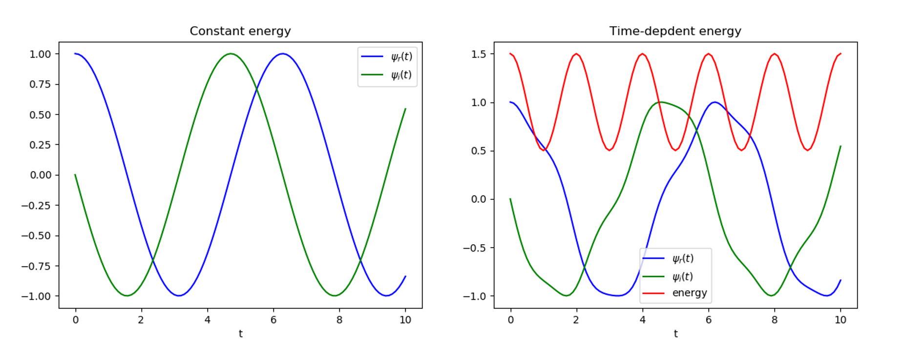
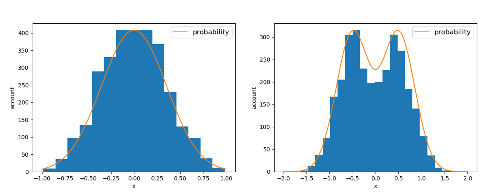

# Corgi
> Classical/Quantum Monte Carlo simulation and analysis

## Features
+ Robust and Fast Quantum System Evolution Calculation

+ Generate customed-distribution-orientied high quality sampling based on MCMC (under development)

+ Classical Monte Carlo
+ Vartional Monte Carlo
+ Auxiliary-field Monte Carlo
+ Diffusion Monte Carlo
+ Time-dependent Monte Carlo

## Contact
longyang_123@yeah.net  
You're most welcome to contact with me to discuss any detail about this project